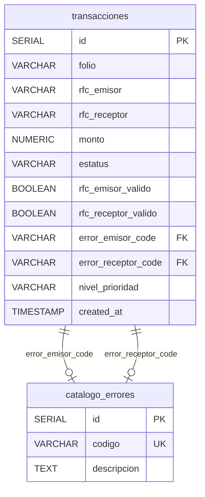

# Sistema de Gestión CFDI

Herramienta interna para la gestión de Comprobantes Fiscales Digitales (CFDI) que presentan inconsistencias.

## Stack Tecnológico

| Capa | Tecnología |
|------|-----------|
| Backend | Node.js + Express |
| Base de Datos | PostgreSQL 15 |
| Frontend | HTML / CSS / JavaScript |
| Reportes | PDFKit |
| Testing | Jest |
| Contenedores | Docker + Docker Compose |

---

## Diagrama de Base de Datos



### Vista `vw_transacciones_errores`

Une `transacciones` con `catalogo_errores` para mostrar la descripción del tipo de error RFC por cada registro.

### Stored Procedure `sp_insert_transaccion`

Calcula automáticamente el `nivel_prioridad`:
- **Alta**: Monto > $50,000 MXN
- **Normal**: Monto ≤ $50,000 MXN

---

## Estructura del Proyecto

```
proyecto/
├── src/
│   ├── config/
│   │   └── database.js         # Pool de conexión PostgreSQL
│   ├── controllers/
│   │   └── transaccionController.js  # Handlers de rutas
│   ├── middlewares/
│   │   └── auth.js             # Middleware X-API-KEY
│   ├── models/
│   │   └── transaccionModel.js # Capa de acceso a datos
│   ├── routes/
│   │   └── index.js            # Definición de rutas
│   ├── services/
│   │   ├── pdfService.js       # Generación de reportes PDF
│   │   └── rfcValidator.js     # Validación de RFC
│   └── server.js               # Entry point de Express
├── public/
│   ├── index.html              # Dashboard
│   ├── styles.css              # Estilos dark theme
│   └── app.js                  # Lógica del frontend
├── db/
│   └── init.sql                # Schema, SP, Vista, Catálogo
├── data/
│   └── sample.json             # Datos de prueba
├── tests/
│   └── rfcValidator.test.js    # Pruebas unitarias
├── Dockerfile
├── docker-compose.yml
├── .env.example
├── package.json
└── README.md
```

---

## Instalación y Ejecución

### Opción 1: Docker Compose (la recomendada para el caso pedido)

```bash
# 1. Clonar el repositorio
git clone <url-del-repositorio>
cd proyecto

# 2. Levantar servicios
docker-compose up --build

# 3. Acceder al Dashboard
# http://localhost:3000
```

Esto levanta automáticamente PostgreSQL (con el schema ya aplicado) y la aplicación Node.js.

### Opción 2: Instalación Manual

```bash
# 1. Clonar el repositorio
git clone <url-del-repositorio>
cd proyecto

# 2. Instalar dependencias
npm install

# 3. Configurar variables de entorno
cp .env.example .env
# Editar .env con los datos de tu PostgreSQL local

# 4. Crear la base de datos y ejecutar el schema
psql -U postgres -c "CREATE DATABASE cfdi_db;"
psql -U postgres -d cfdi_db -f db/init.sql

# 5. Iniciar la aplicación
npm start

# 6. Acceder al Dashboard
# http://localhost:3000
```

---
## Insertar registros
En caso de que los registros no se enucuentren al correr la la aplicacion, simplemente se pueden subir manualmente los ejemplos que se encuentran en la carpeta `data` los cuales ya estan en formato json listos para usarse

## Endpoints de la API

Todas las rutas bajo `/api` requieren el header `X-API-KEY`.

| Método | Ruta | Descripción |
|--------|------|-------------|
| `POST` | `/api/transacciones` | Carga un JSON con transacciones, valida RFCs e inserta vía Stored Procedure |
| `GET` | `/api/transacciones` | Lista transacciones. Soporta `?rfc_emisor=XXX` |
| `GET` | `/api/transacciones/reporte` | Genera un PDF filtrable por `?rfc_emisor=XXX` |
| `GET` | `/health` | Health check (no requiere autenticación) |

### Ejemplo de uso con cURL

```bash
# Cargar transacciones
curl -X POST http://localhost:3000/api/transacciones \
  -H "Content-Type: application/json" \
  -H "X-API-KEY: JyQfnJyKYwtKUhZKMUgpoOPotgkMWRft" \
  -d @data/sample.json

# Listar transacciones
curl http://localhost:3000/api/transacciones \
  -H "X-API-KEY: JyQfnJyKYwtKUhZKMUgpoOPotgkMWRft"

# Filtrar por RFC Emisor
curl "http://localhost:3000/api/transacciones?rfc_emisor=GARC850101HN1" \
  -H "X-API-KEY: JyQfnJyKYwtKUhZKMUgpoOPotgkMWRft"

# Exportar PDF
curl -o reporte.pdf "http://localhost:3000/api/transacciones/reporte?rfc_emisor=GARC850101HN1" \
  -H "X-API-KEY: JyQfnJyKYwtKUhZKMUgpoOPotgkMWRft"

# Sin API Key → 401 Unauthorized
curl http://localhost:3000/api/transacciones
```

---


## Consideraciones para las pruebas

Se debe ejcutar el comando que se muestra a continuacion antes de ejecutar `npm test` para instalar las dependecias y con ello jest
```bash
npm install
```

## Pruebas Unitarias
Ejecutar el comando en la terminal para correr las pruebas unitarias
```bash
npm test
```


Las pruebas validan la función `validateRfc()` con los siguientes casos:

| # | Caso | Resultado Esperado |
|---|------|--------------------|
| 1 | RFC vacío `""` | `RFC_EMPTY` |
| 2 | RFC `null` | `RFC_EMPTY` |
| 3 | RFC `undefined` | `RFC_EMPTY` |
| 4 | RFC solo espacios | `RFC_EMPTY` |
| 5 | Longitud < 12 | `RFC_LENGTH_INVALID` |
| 6 | Longitud > 13 | `RFC_LENGTH_INVALID` |
| 7 | Un solo carácter | `RFC_LENGTH_INVALID` |
| 8 | Con guiones | `RFC_SPECIAL_CHARS` |
| 9 | Con puntos | `RFC_SPECIAL_CHARS` |
| 10 | Con espacios internos | `RFC_SPECIAL_CHARS` |
| 11 | 12 chars patrón incorrecto | `RFC_FORMAT_INVALID` |
| 12 | 13 chars inicia con números | `RFC_FORMAT_INVALID` |
| 13 | Persona moral válida (12) | `valid: true` |
| 14 | RFC con `&` válido (12) | `valid: true` |
| 15 | Persona física válida (13) | `valid: true` |
| 16 | RFC con `Ñ` válido (13) | `valid: true` |

---

## Variables de Entorno

| Variable | Descripción | Default |
|----------|-------------|---------|
| `API_KEY` | Clave de autenticación X-API-KEY | — |
| `PORT` | Puerto del servidor | `3000` |
| `DB_HOST` | Host de PostgreSQL | `localhost` |
| `DB_PORT` | Puerto de PostgreSQL | `5432` |
| `DB_USER` | Usuario de PostgreSQL | `postgres` |
| `DB_PASSWORD` | Contraseña de PostgreSQL | `postgres` |
| `DB_NAME` | Nombre de la base de datos | `cfdi_db` |

---

## Lógica de Negocio

### Validación de RFC
- **Persona Moral**: 3 letras (A-Z, Ñ, &) + 6 dígitos + 3 alfanuméricos = **12 caracteres**
- **Persona Física**: 4 letras + 6 dígitos + 3 alfanuméricos = **13 caracteres**
- Regex: `/^[A-ZÑ&]{3,4}[0-9]{6}[A-Z0-9]{3}$/i`

### Nivel de Prioridad (calculado por el Stored Procedure)
- **Alta**: Monto > $50,000 MXN
- **Normal**: Monto ≤ $50,000 MXN

### Resaltado en Dashboard
Las filas `RFC EMISOR VALIDO` y `RFC RECEPTOR VALIDO` marcan con una paloma o un tache si el RFC es correcto o no segun el caso. Si algun de los dos o los dos no cuumplen, se resalta la fila en rojo

---